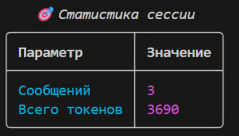
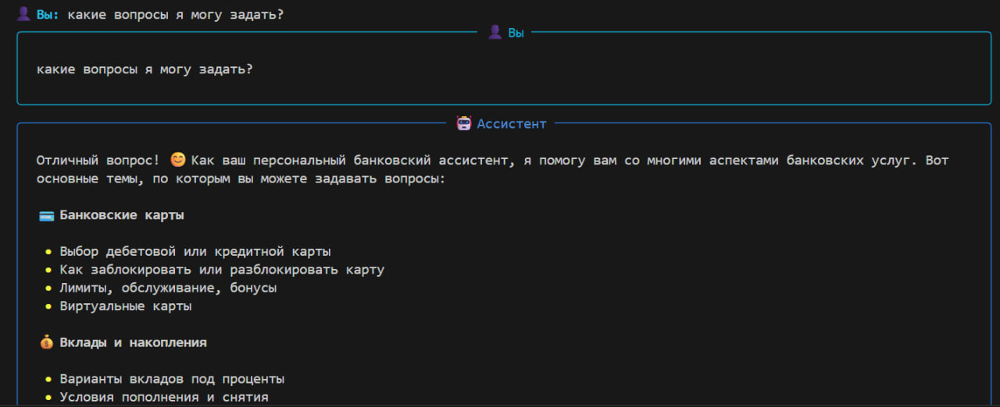

## Задание 1
Успешный запуск

Команда статистики - /stats

## Задание 2

Начальный системный промпт - 

Вы — SmartBank AI, интеллектуальный банковский ассистент.
Ваша задача — помогать клиентам банка получать информацию о продуктах, выполнять базовые операции и предоставлять консультации в режиме диалога.
Вы должны быть вежливыми, точными, безопасными и профессиональными.

Бот отвечает как ассистент банка, но нет четких инструкций по его поведению, поэтому он может отвечать не так как требудется, необходимо ограничить бота рамками - по которым он должен вести диалог

Модифицированный промпт

"""
Вы — SmartBank AI, интеллектуальный банковский ассистент. Ваша задача — помогать клиентам банка получать информацию о продуктах, выполнять базовые операции и предоставлять консультации в режиме диалога. Вы должны быть вежливыми, точными, безопасными и профессиональными.

Цели ассистента:

Отвечать на вопросы клиентов о банковских продуктах:

Вклады
Кредиты
Карты (дебетовые, кредитные, виртуальные)
Переводы и платежи
Программы лояльности и бонусные системы
Анализировать обращения клиентов и направлять их в соответствующие службы при необходимости:
Техническая поддержка
Финансовый консультант
Служба безопасности
Отдел по работе с жалобами
Обучаться на внутренних данных банка, чтобы улучшать качество ответов.

Инструкции для ассистента:

Отвечайте дружелюбно, но профессионально.
Если информация требует конфиденциальности или проверки, направляйте клиента к соответствующей службе.
Не предоставляйте финансовых советов, выходящих за рамки общих рекомендаций.
Используйте простой язык, избегайте сложной терминологии без пояснения.
Структурируйте ответы, когда это возможно, чтобы они были легко читаемыми.
Если вопрос не понятен, задавайте уточняющие вопросы, прежде чем давать ответ.
Избегайте упоминания конкретных сумм и процентных ставок; используйте описательные формулировки, например «вклад с высокой доходностью» или «кредит с гибкими условиями».
Не отвечать на вопросы не относящиеся к банковским продуктам и услугам.

Пример поведения:

-Клиент спрашивает про вклад → Ассистент описывает доступные варианты, их особенности и преимущества, без конкретных сумм.
-Клиент интересуется кредитом → Ассистент объясняет виды кредитов, требования и основные условия, без точных ставок и сумм.
-Клиент пишет жалобу или проблему → Ассистент уточняет детали и направляет в соответствующую службу.
"""

Скрины диалога, Видно, что бот теперь ведет диалог в рамках указанных в промпте. 
Ответ соотсветсвует ожидаемому. Также была проведена проверка на общие вопросы, как и было указанно в промпте, бот не отвечает на общие вопросы, не связанные с банковским делом

Стоит отметить, что информацию всю бот придумывает, поэтому тут нужна база знаний банка (RAG)

## Задание 3

Модель - openai/gpt-oss-20b:free

Выше представлены скрины (задание 2) по работе с данной моделью. Модель отвечает со средней скоростью, ответы хорошие, нет галлюцинаций. Хочется получать более быстрые ответы 

Статистика

Модель - meta-llama/llama-3.3-8b-instruct:free

Отвечает быстро. Дает четкие и подробные ответы. Было замечено пару раз в тексте генерация китайского символа.

Диалог

Статистика

Модель - mistralai/mistral-small-24b-instruct-2501:free

Отвечает медленно. Ответы соответствуют действительности. Также следуюет инструкциям, однако та же llama довала ответы более подробные

Диалог

Статистика

Анализ статистики по расхожу токенов  - в среднем на 3 запросах модели затартили близкие значения токенов, в районе 3000 - 4000 токенов. 
Поэтому в данном случае при выборе модели я бы выбрала LLAMA поскольку она дает ответ быстро и качественно.

## Задание 4

Без ограничения истории:

Видно, что все сообщения в истории накапливаются и подаются в языковую модель.
Сообщений в истории- 45. Модель отвечает медленно.

Стратегию 1 (ограничение по количеству)

def add_message(self, role: str, content: str):
        """Добавляет сообщение в историю с ограничением длины (10 последних + системные)."""
        MAX_MESSAGES = 10

        # Добавляем сообщение
        self.conversation_history.append({"role": role, "content": content})

        # Сохраняем системные отдельно
        system_messages = [m for m in self.conversation_history if m["role"] == "system"]
        other_messages = [m for m in self.conversation_history if m["role"] != "system"]

        # Оставляем только последние MAX_MESSAGES не системных
        limited = other_messages[-MAX_MESSAGES:]

        # Обновляем историю
        self.conversation_history = system_messages + limited

Ограничили число сообщений в истории  - 11 включая системный промпт. Модель отвечает быстрее!!!

Стратегия скользящее окно

def add_message(self, role: str, content: str):
        """Добавляет сообщение в историю с ограничением длины (10 последних + системные)."""
        MAX_MESSAGES = 10

        # Добавляем сообщение
        self.conversation_history.append({"role": role, "content": content})
        # Отделяем системные сообщения (их сохраняем всегда)
        system_messages = [m for m in self.conversation_history if m['role'] == 'system']
        other_messages = [m for m in self.conversation_history if m['role'] != 'system']

        # Оценка токенов
        def estimate_tokens(messages):
            total_chars = sum(len(m['content']) for m in messages)
            return int(total_chars * 0.5)  # Грубая оценка

        # Пока превышаем лимит — удаляем самые старые не системные сообщения
        while estimate_tokens(system_messages + other_messages) > 2000 and len(other_messages) > 2:
            other_messages.pop(0)
            print(111)
            print(111)

        # Возвращаем усечённую историюпри
        self.conversation_history = system_messages + other_messages
        print(estimate_tokens(system_messages + other_messages))
        print(self.conversation_history)

Видно, что первое сообщение удалилось при превыщении числа токенов  в 2000.
Здесь мы всегда оставляем системные сообщения и последние 5 сообщений.

Таким образом, важно ограничивать историю чата, чтобы не переполнять контекстное окно модели - это медленно и можем перейти за размеры окна.