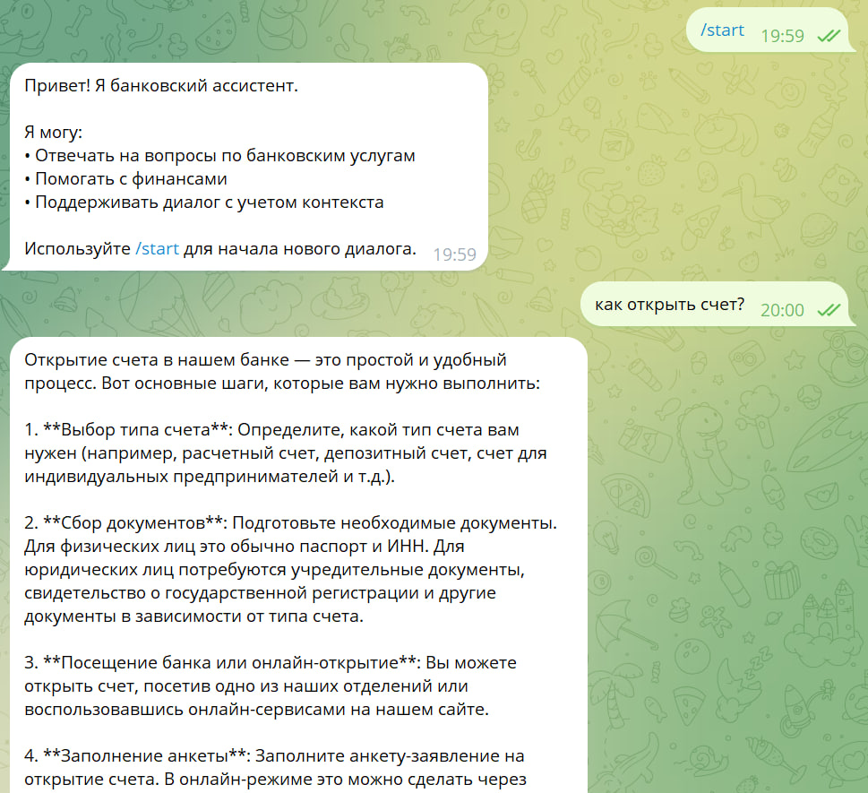

# Отчет по выполнению задания — Telegram LLM Bot (03-aidd)

## Название проекта
03-aidd — Telegram LLM Bot (мини-проект)

Краткое описание
Простой, лёгковесный Telegram-бот с интеграцией LLM через OpenRouter. Бот ведёт диалог с пользователем, сохраняет контекст беседы в памяти процесса и отвечает на банковские вопросы.

---

## Роль ИИ-ассистента и обоснование
Выбранная роль: банковский ассистент (friendly, domain-aware)

Обоснование: проект нацелен на сценарии, связанные с банковскими продуктами и услугами. Чёткая роль позволяет задать системный промпт, ограничить пространство ответов и повысить полезность и безопасность — бот даёт релевантные, прагматичные ответы по банковским вопросам.

---

## Реализованные возможности
- [x] Приём и обработка текстовых сообщений от пользователя
- [x] Команда `/start` для начала/сброса диалога
- [x] Интеграция с LLM через OpenRouter (адаптивный клиент)
- [x] Сохранение истории диалога в памяти процесса (per-user)
- [x] Ограничение длины сообщений и проверка пустых/некорректных вводов
- [x] Ограничение длины истории (предотвращение раздувания запроса)
- [x] Дружественные сообщения об ошибках и отдельная обработка ошибок LLM (rate limit, network)
- [x] Асинхронная обработка запросов (aiogram + async LLM client)

---

## Технологический стек
- Python 3.11
- aiogram (Telegram bot framework)
- openai (OpenAI-compatible client) — через OpenRouter
- uv — dependency manager used in Makefile
- dotenv / .env for конфигурации
- Простая in-memory структура для истории диалогов (словарь в Python)

---

## Инструменты AI-driven разработки
- Используемая AI-coding IDE: Visual Studio Code с GitHub Copilot (локальная разработка и автодополнение)
- Используемые LLM модели для генерации документации и кода:
  - openai/gpt-oss-20b:free (через OpenRouter) — использовалась для генерации текстов/ответов и помощи при разработке
  - GitHub Copilot (на базе проприетарных/модельных стеков) — помогает при автогенерации кода и рефакторинге

---

## Скриншот работы
Ниже ссылка на пример диалога (включите файл скриншота в `03-aidd/screenshots/`):





(Прикреплённый скриншот показывает: /start → приветствие; далее вопрос "как открыть счет?" и развёрнутый ответ.)


(Прикреплённый скриншот показывает сохранение истории чата)

---

## Процесс разработки: основные вызовы и решения
- Проблема: модули и пути при запуске бота могли ломать импорты.
  - Решение: запускать как модуль (`python -m src.bot`) и привести импорты к форме `from src.config import config`.

- Проблема: необходимость интеграции с OpenRouter/OpenAI и обработка ошибок (rate limit, network, неожиданное поведение).
  - Решение: реализована обертка `src/llm.py` с отдельными исключениями (RateLimitError, NetworkError, LLMError) и дружелюбными ответами пользователю.

- Проблема: сохранить контекст диалога без долгого роста запроса к LLM.
  - Решение: хранить историю в памяти per-user и ограничивать длину истории (например, 20 последних диалогов), сбрасывать по `/start`.

- Проблема: нагрузка и UX при длительных запросах к LLM.
  - Решение: использовать асинхронный клиент и показывать индикатор "typing" пользователю.

---

## Что узнал нового в процессе AI-driven разработки (3–5 пунктов)
1. Интеграция LLM через прокси/шлюз (OpenRouter) требует аккуратной обработки base_url и ключей — это удобный способ подключить нестандартные модели.
2. Важность явной стратегии работы с контекстом (how much history to keep): простой in-memory подход хорош для прототипа, но для production нужен Redis/DB.
3. Полезность AI-coding инструментов (Copilot, LLM) для ускорения написания шаблонов и тестов — но всегда нужен ручной ревью и тесты.
4. Обработка ошибок LLM (rate limits, network failures) должна быть частью UX: показывать пользователю понятные подсказки и не сохранять неоправданные состояния.
5. Запуск проекта как модуля (`python -m src.bot`) решает распространённые проблемы с относительными импортами при структуре `src/`.

---

## (Опционально) Ссылка на работающего бота
Бот запускается локально командой:

```bash
make run
```

Чтобы поделиться публичной ссылкой (если бот развернён), укажите URL или домен, где он развернут — в этом репозитории бот пока не размещён публично.

---

## Примечания и дальнейшие шаги
- Рекомендую добавить небольшой раздел Troubleshooting в `03-aidd/README.md` (частые проблемы: виртуальное окружение, uv, импорты, переменные окружения).
- Для production: вынести историю в Redis, добавить rate-limiting и аутентификацию, покрыть ключевые функции unit-тестами и настроить CI.

---

Отчёт сгенерирован на основании текущего состояния репозитория и прикреплённого скриншота.
