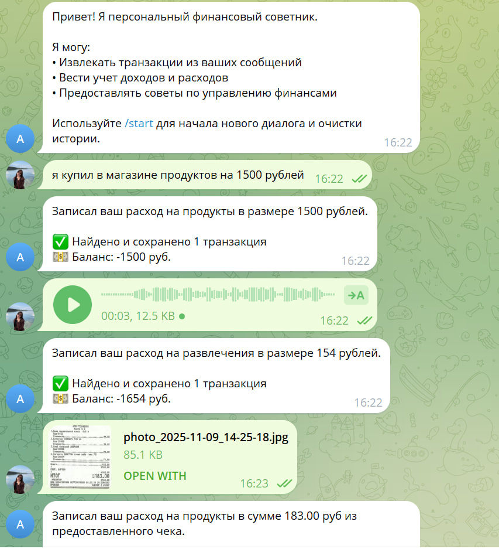

# Отчёт о выполнении задания

## Название проекта
**Персональный финансовый советник**

## Краткое описание
Telegram-бот для учета доходов и расходов с интеграцией LLM через OpenRouter или Ollama. Бот позволяет автоматически извлекать транзакции из текстовых и аудио-сообщений, обрабатывать изображения чеков и предоставлять отчёты о балансе и статистике расходов.

## Вариант задания
Расширенный

## Реализованные возможности
- [x] Извлечение транзакций из текстовых сообщений  
- [x] Обработка изображений чеков и скриншотов  
- [x] Автоматическая категоризация транзакций  
- [x] Отчеты о балансе и статистике  
- [x] История всех транзакций  
- [x] Поддержка локальных моделей через Ollama  
- [x] Обработка аудио-сообщений (транскрибация через Whisper и извлечение транзакций)

## Технологический стек
- **Язык программирования:** Python 3.11+  
- **Менеджер зависимостей:** uv  
- **Фреймворк для Telegram:** aiogram  
- **Клиент для LLM:** OpenAI / Ollama  
- **Используемые модели:** llama3.2, llama3.2-vision, openai/gpt-oss-20b:free, qwen/qwen2.5-vl-32b-instruct, wisper

## Инструменты AI-driven разработки
- IDE: VSCode  
- LLM модели: Ollama, OpenRouter  

## Скриншот работы
- 

## Облачный сервер
- **Провайдер:** Ollama локально / OpenRouter облачно  
- **GPU:** поддержка через Ollama на локальной машине  
- **Модели:** llama3.2, llama3.2-vision  

## Основные вызовы и решения
- **Проблема:** корректная обработка изображений чеков с разным качеством  
  **Решение:** интеграция модели с поддержкой vision и обработка OCR через LLM  
- **Проблема:** транскрибация аудио  
  **Решение:** интеграция Whisper для автоматической транскрибации и дальнейшей обработки LLM  

## Что узнал нового
1. Интеграция LLM для извлечения структурированных данных из текста и изображений  
2. Использование локальных моделей через Ollama для приватной обработки данных  
3. Настройка Telegram бота с поддержкой команд и автоматической категоризацией транзакций  
4. Работа с аудио-сообщениями и их транскрибация для последующей аналитики  
