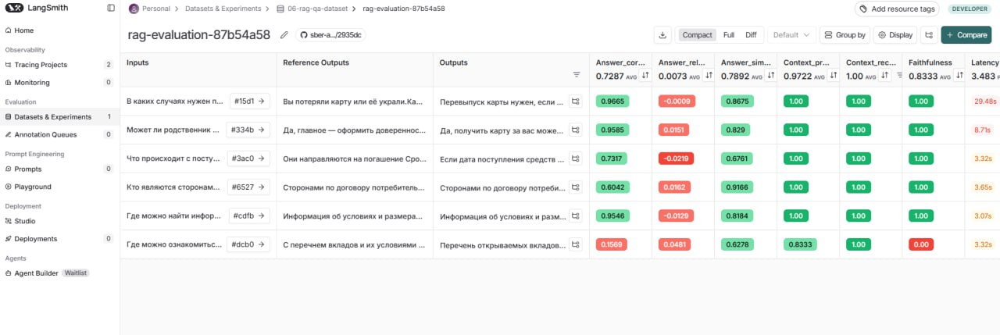

# Отчёт о выполнении задания

## Название проекта и описание

**RAG-ассистент Сбербанка** — Telegram-бот с RAG (Retrieval-Augmented Generation) для ответов на вопросы по документам Сбербанка о кредитах и вкладах.

Проект реализует систему вопросно-ответного поиска на основе документов с использованием:
- RAG на базе LangChain
- Индексации PDF и JSON документов
- Синтез тестовых датасетов
- Оценки качества через RAGAS метрики

## Вариант задания

**Базовый**

## Используемые модели и провайдеры

### Для RAG системы:
- **LLM (основная модель)**: `gpt-4.1` (OpenAI)
- **LLM (query transformation)**: `gpt-4.1` (OpenAI)
- **Embeddings**: `text-embedding-3-large` (OpenAI)

### Для RAGAS evaluation:
- **LLM**: `gpt-4.1` (OpenAI)
- **Embeddings**: `text-embedding-3-large` (OpenAI)

## Создание и загрузка датасета

### Способ создания датасета

Датасет создан **комбинированным способом**:
1. **Автоматический синтез из PDF** (4 примера):
   - Загружаются PDF документы из директории `data/`
   - Выбираются чанки документов (по 2 из каждого PDF файла)
   - LLM синтезирует вопросы и ответы на основе выбранных чанков
   - Используется модель из конфигурации (`gpt-4.1`)

2. **Загрузка готовых Q&A пар из JSON** (2 примера):
   - Загружаются готовые вопросно-ответные пары из `sberbank_help_documents.json`
   - Выполняется случайная выборка (по 2 примера из файла)

### Размер датасета

**Всего примеров: 6**
- Синтезированных из PDF: 4
- Загруженных из JSON: 2

### Скриншот датасета в LangSmith



### Примеры Q&A пар из датасета

#### Пример 1 (синтезированный из Json):

**Вопрос:**
```
В каких случаях нужен перевыпуск карты?
```

**Ответ (ground truth):**
```
Вы потеряли карту или её украли.Карта технически неисправна. Например, стёрся номер или размагнитился чип.Если данные карты попали к мошенникам. В таком случае Сбер пришлёт вам СМС об опасности и заблокирует карту, чтобы мошенники не смогли ей воспользоваться.Карту зажевал банкомат, и нет возможности её достать.Чтобы заказать досрочный перевыпуск карты, зайдите в СберБанк Онлайн → нажмите на нужную карту → «Настройки» → «Перевыпустить».",
```

**Источник:** `sberbank_help_documents.json` Вопросы о дебетовых картах

#### Пример 2 (из PDF):

**Вопрос:**
```
Где можно ознакомиться с перечнем вкладов и их условиями в ПАО Сбербанк?
```

**Ответ (ground truth):**
```
С перечнем вкладов и их условиями можно ознакомиться в разделе '2. Где можно ознакомиться с перечнем вкладов и их условиями' Общих условий размещения вкладов в ПАО Сбербанк.",
```

**Источник:** `data\\usl_r_vkladov.pdf`, стр 0

## Оценка качества через RAGAS

### Используемые метрики

Для оценки качества RAG системы используются **6 метрик RAGAS**:

1. **Faithfulness (Обоснованность)** — проверяет, что ответ не содержит галлюцинаций и основан только на retrieved документах
2. **Answer Relevancy (Релевантность ответа)** — оценивает, насколько ответ релевантен заданному вопросу
3. **Answer Correctness (Правильность ответа)** — сравнивает ответ с ground truth эталоном
4. **Answer Similarity (Похожесть на эталон)** — измеряет семантическую похожесть ответа на эталонный
5. **Context Recall (Полнота контекста)** — проверяет, содержат ли retrieved документы информацию, необходимую для правильного ответа
6. **Context Precision (Точность поиска)** — оценивает, насколько retrieved документы релевантны вопросу

