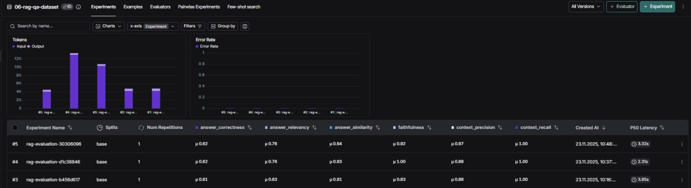
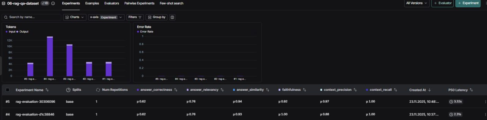
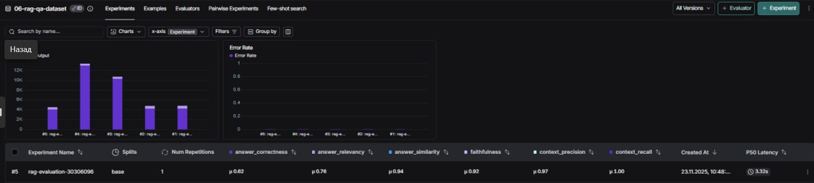

# 📘 Advanced RAG Experiments

Экспериментальное исследование стратегий Retrieval-Augmented Generation (RAG) с использованием современных эмбеддингов, гибридного поиска и reranker-моделей.

## 🧩 Используемый стек

### 🔤 **Эмбеддинги**

* `intfloat/multilingual-e5-base` (HuggingFace)
* Запуск на **MPS** (Apple Silicon)

### 🤖 **LLM**

* Трансформация запроса: `gpt-4o`
* Генерация ответа: `gpt-4o`

### 🛠️ **Оценка качества**

Использовалась утилита `evaluate_with_ragas`, включающая три шага:

1. Генерация ответов от модели
2. Подсчёт метрик RAGAS
3. Загрузка результатов в LangSmith

Метрики:

* **faithfulness**
* **answer_relevancy**
* **answer_correctness**
* **answer_similarity**
* **context_recall**
* **context_precision**

Все эксперименты выполнялись на **одном и том же батче из 6 вопросов** датасета *06-monitoring-qa*.

---

# 📊 Эксперименты

## 1. Semantic Retrieval (базовый)

**Описание:**
Чисто семантический поиск по векторному хранилищу.

**Настройки:**

* Эмбеддинги: `multilingual-e5-base`
* Query rewriting: `gpt-4o`
* Ответ: `gpt-4o`

Это — baseline для последующего сравнения.

---

## 2. Hybrid Retrieval (Semantic + BM25)

**Описание:**
Комбинация векторного семантического поиска и BM25.

**Настройки:**

* Семантический поиск `k=10`
* BM25 `k=10`
* Веса результатов: `0.5 / 0.5`
* Эмбеддинги и LLM как в baseline

**Цель:**

* Повысить полноту поиска
* Захватить как семантические совпадения, так и точные терминологические

---

## 3. Hybrid Retrieval + Cross-Encoder Reranker

**Описание:**
Сначала гибридная выдача, затем reranking через мощный кросс-энкодер.

**Настройки:**

* Semantic k = 10
* BM25 k = 10
* Веса поиска = 0.5 / 0.5
* Reranker: `cross-encoder/mmarco-mMiniLMv2-L12-H384-v1`
* Top-k после reranker: **3**

**Идея:**
Убрать нерелевантные фрагменты, сохранив полноту поиска и улучшив точность.

---

# 📈 Результаты и анализ

### 🔍 Общие наблюдения

* Все режимы показывают **context_recall = 1.0**
  → система всегда находит нужный контекст
* Различия проявляются в:

  * faithfulness
  * answer_relevancy
  * context_precision
  * answer_correctness

---

## 📌 Сравнение режимов

### 🟦 1. Semantic Retrieval (baseline)

* Средняя точность без дополнительных сигналов
* Хороший ориентир для сравнений

### 🟧 2. Hybrid Retrieval

* **Лучший показатель *faithfulness*** среди всех режимов
* Но **хуже precision**, чем в reranker-конфигурации
* Подходит, если важна максимальная ширина контекста (ручной анализ, исследования)

### 🟩 3. Hybrid + Reranker (оптимальная конфигурация)

Достоинства:

* +0.09 к **faithfulness** относительно baseline
* +0.13 к **answer_relevancy**
* **context_precision = 0.97** → почти нет нерелевантных источников
* Сохраняет **context_recall = 1.0**

Это единственный режим, который одновременно увеличивает:

* достоверность (faithfulness = 0.92)
* точность ответа (answer_correctness = 0.62)
* чистоту контекстов

---

# 🏆 Итоговые рекомендации

### ✔ Рекомендуемая конфигурация: **Hybrid + Cross-Encoder Reranker**

Подходит для:

* production RAG
* задач, где важна точность и достоверность ответа
* строгой фильтрации контекста

### ➕ Когда использовать гибрид без reranker

* исследования
* ручная аннотация данных
* задачи, где важно собрать максимум потенциально полезных контекстов

### ➖ Когда использовать чистый семантический поиск

* быстрые baseline-тесты
* ограниченные вычислительные ресурсы
