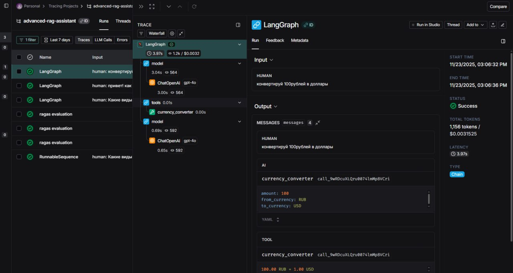
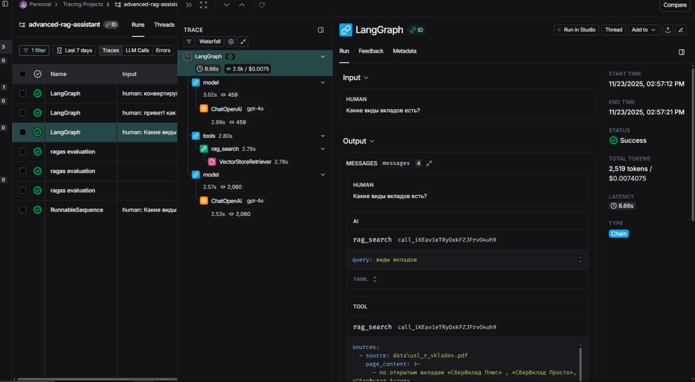
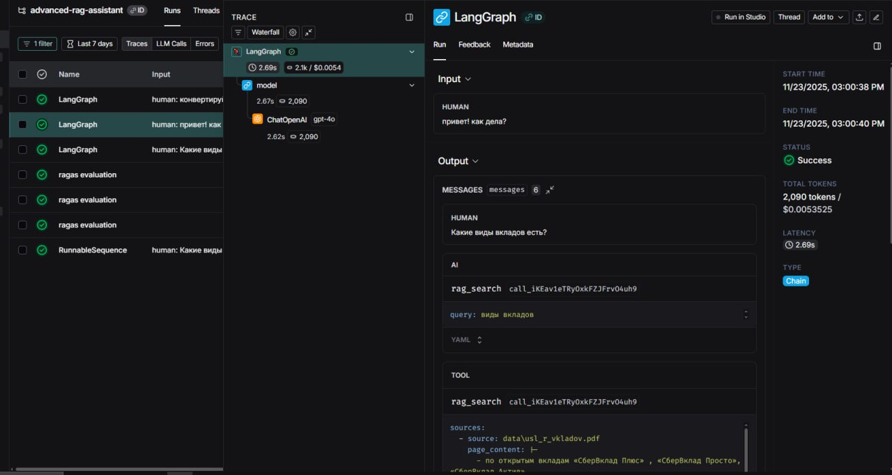

# 🧠 Agent + Tools Architecture Overview

---

## 📌 Что сделано

В текущей реализации создан **агент**, который может:

* анализировать пользовательский запрос,
* выбирать подходящий инструмент (tool),
* вызывать его с корректными аргументами,
* возвращать результат пользователю.

На данный момент в систему добавлен инструмент:

### 🔧 **Инструмент: `currency_converter`**

Предназначен для:

* конвертации суммы между валютами (USD, EUR, RUB).

Агент принимает решение о его вызове на основании:

* описания инструмента,
* контекста запроса пользователя.

Пример запроса:

> "Переведи 100 долларов в евро"

→ Агент понимает, что запрос относится к финансовой конвертации, и вызывает `currency_converter`.

---

# 🧠 Как агент принимает решения о вызове инструментов

Основа механизма — **tool selection**.

Агент получает:

1. описание всех доступных инструментов;
2. текущий пользовательский запрос;
3. текущий контекст диалога (если есть).

Далее модель:

* классифицирует тип запроса,
* сравнивает его с описаниями инструментов,
* если находит подходящий — формирует корректный вызов tool-a,
* если нет — отвечает сама (LLM reasoning).

Механизм похож на функцию маршрутизации:

* если запрос подходит под инструмент → вызываем инструмент,
* если нет → используем обычную генерацию LLM.

Слуай, когда инструменты не вызываются - простое общение

---

# 🔍 Отличия агента от простой RAG-цепочки

| Характеристика   | Простая RAG-цепочка                         | Агент с инструментами                                                  |
| ---------------- | ------------------------------------------- | ---------------------------------------------------------------------- |
| Принятие решений | Всегда выполняет один и тот же пайплайн RAG | Анализирует запрос и выбирает подходящий инструмент                    |
| Типы действий    | Только поиск по векторной БД + генерация    | Может вызывать разные инструменты: БД, API, функции, конвертеры и т.д. |
| Контексты        | Один источник данных                        | Агент может выбирать между разными источниками                         |
| Гибкость         | Ограничена RAG-пайплайном                   | Максимальная гибкость: доступ к коду, API, внешним сервисам            |
| Пример           | «Что в документации?» → только поиск        | «Сконвертируй валюту» → вызывает currency_converter                    |

Таким образом, агент — это **надстройка** над RAG, которая превращает систему в интеллектуального ассистента со способностью выполнять действия.

---

# ⚙ Пример архитектуры с несколькими инструментами

Агент сам выберет, что использовать.

Например:

> "Как настроить алерты в Prometheus?"
> → агент использует инструмент RAG с monitoring-БД

> "Переведи 100 EUR в RUB"
> → агент использует инструмент currency_converter

---

# ✔ Преимущества агентного подхода

### 1. **Гибкость**

Одна LLM может:

* отвечать на вопросы,
* выполнять вычисления,
* ходить в разные источники данных,
* использовать разные RAG-базы.

### 2. **Расширяемость**

Можно добавлять новые инструменты без изменения логики агента.
Просто предоставляете модельное описание — LLM сама научится ими пользоваться.

### 3. **Контролируемость**

Каждый вызов фиксируется в логах (например, LangSmith).
Можно отлаживать поведение модели.

### 4. **Повышенная полезность**

В отличие от RAG-ботов, агент может делать реальную работу:
конвертация валют, генерация документов, SQL-запросы, API-вызовы и др.

---

# ⚠ Ограничения и сложности

### 1. **Ошибки выбора инструмента**

LLM может:

* ошибиться в классификации запроса,
* вызвать неправильный инструмент,
* вызвать инструмент с неправильными аргументами.

### 2. **Зависимость от описания инструментов**

Если описание слишком слабое → модель хуже понимает, когда нужно вызывать инструмент.
Если слишком длинное → растёт токен-контекст.

### 3. **Отсутствие гарантий корректного поведения**

LLM может:

* попытаться сделать всё сама вместо вызова инструмента,
* наоборот, вызывать инструмент там, где не нужно.

### 4. **Необходимость тестирования и трейсинга**

Нужны:

* LangSmith
* тестовые сценарии

чтобы уверенно контролировать tool-selection.

---

# 📌 Итог

Использование агентного подхода даёт системе:

* больше возможностей,
* гибкую архитектуру,
* поддержку произвольных инструментов и RAG-баз,
* умение выбирать правильный инструмент по запросу пользователя.

Добавленный инструмент `currency_converter` является примером функционала, который агент вызывает **только если запрос соответствует описанию инструмента**, что демонстрирует корректную работу tool-selection.

